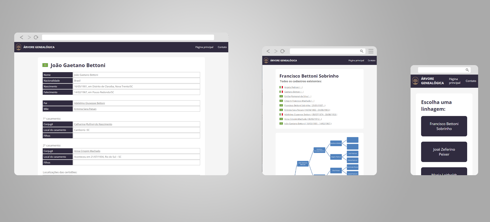

# Árvore Genealógica
Projeto pessoal para apresentar a árvore genealógica.

[@DEMO](https://girafa.digital/arvore_genealogica/)

## Tecnologia
O projeto foi desenvovlido em HTML + CSS + PHP e foi utilizado a plataforma do Wordpress como banco de dados.

## Wordpress
Para que o cadastro as informações seja facilitado foi inserido o plugin Advanced Custom Fields(ACF), através dele conseguimos personalizar campos e captar os valores para deixar o layout mais agradavél.

## Como utilizar
1. Baixe os arquivos desta página
2. Adicione o template no seu site Wordpress
3. Instale o plugin [Advanced Custom Fields](https://www.advancedcustomfields.com/)
4. Importe no plugin ACF o grupo de campos da pasta (arquivo único)
5. Adicione um novo post e comece a utilizar